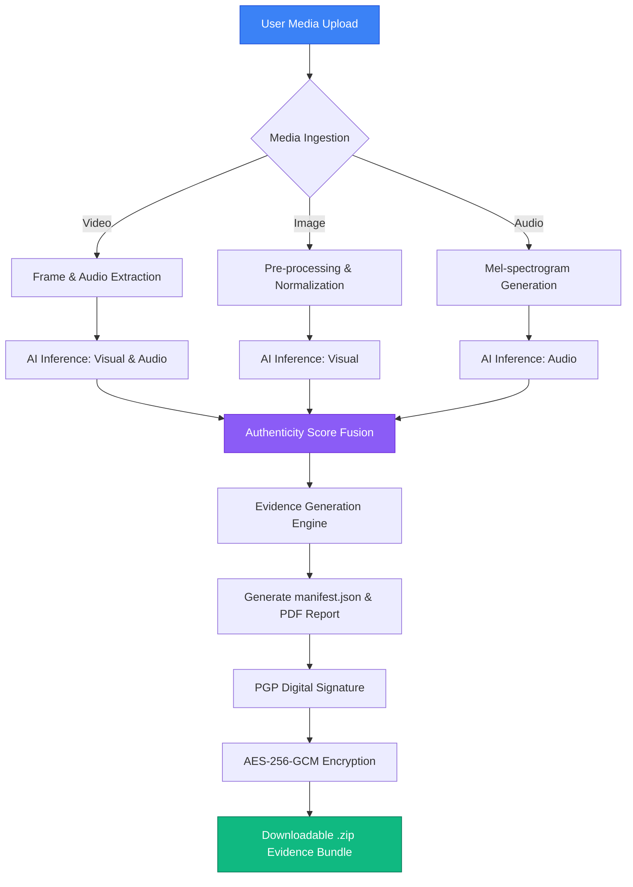

# Project Phoenix: Deepfake Detection & Media Authenticity (Under Development)

Project Phoenix is a high-integrity AI platform designed for the detection of manipulated multimedia content, addressing the growing threat of deepfakes in legal and forensic contexts. 

It leverages state-of-the-art AI architectures for visual and audio forensics while prioritizing legal admissibility through cryptographically signed evidence bundles compliant with **Section 65B of the Bharatiya Sakshya Adhiniyam (BSA)**.

---

## 🚀 Key Features

- **Multi-Modal AI Inference**: Utilizes XceptionNet and EfficientNet-B0 for visual artifacts and CNN-RNN hybrids for audio forgery detection.
- **Section 65B Compliance**: Generates automated certificates and manifests to ensure data integrity and provenance for legal proceedings.
- **Cryptographic Security**: 
  - **PGP Signing**: Server-side signing of manifests for authenticity and non-repudiation.
  - **AES-256-GCM Encryption**: Secure encryption of the final evidence bundle during transit.
- **Premium Dashboard**: A sleek, dark-mode dashboard built with Next.js and Framer Motion for a high-fidelity user experience.
- **Automated Evidence Bundling**: Compiles SHA-256 hashes, UTC timestamps, and detailed PDF reports into a verifiable ZIP package.

---

## � System Architecture & Data Flow



---

## 🛠️ Technology Stack

| Layer | Technologies |
| :--- | :--- |
| **Frontend** | Next.js 15+, TypeScript, TailwindCSS, Framer Motion, Lucide React |
| **Backend** | FastAPI (Python), Uvicorn, SQLAlchemy |
| **AI/ML** | PyTorch, Torchvision, OpenCV, Librosa |
| **Security** | GnuPG (PGP), PyCryptodome (AES-256), SHA-256 |
| **Database** | SQLite (for forensic logging and state tracking) |

---

## ⚖️ Legal Compliance (Section 65B BSA)

To be admissible in a court of law, electronic records must have a verifiable chain of custody. Project Phoenix automates this by:
1. **Hashing (SHA-256)**: Immediate unique identification upon upload.
2. **Deterministic Logging**: Recording exact timestamps and system states.
3. **Immutability via Signature**: Ensuring the report cannot be altered after generation.

---

## 📦 Getting Started

### Prerequisites
- Python 3.10+
- Node.js 18+
- Docker (Optional)

### Installation
1. **Backend Setup**:
   ```bash
   cd backend
   python -m venv .venv
   source .venv/bin/activate
   pip install -r requirements.txt
   python main.py
   ```

2. **Frontend Setup**:
   ```bash
   cd frontend
   npm install
   npm run dev
   ```

---

## � License
This project is licensed under the MIT License.
